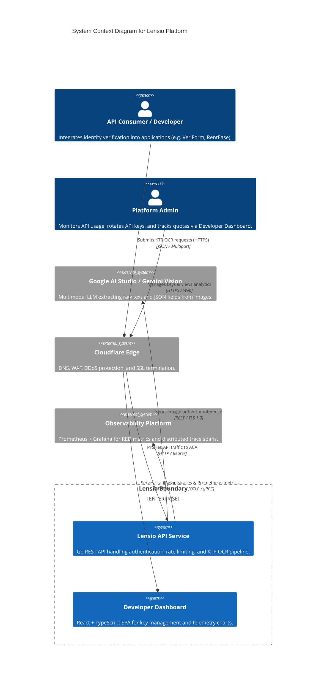
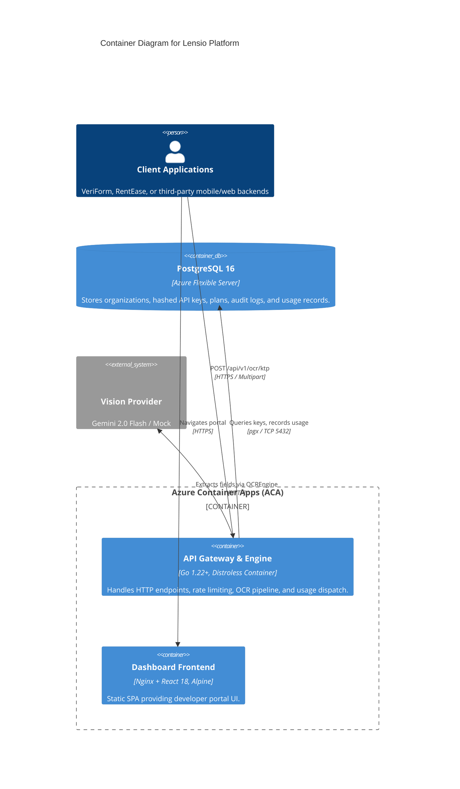
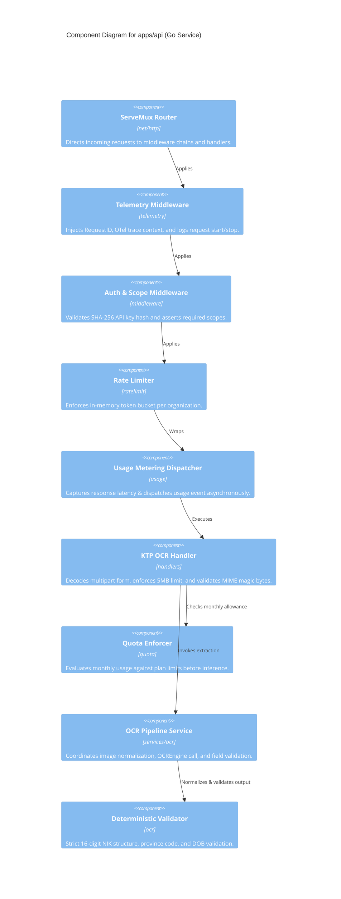
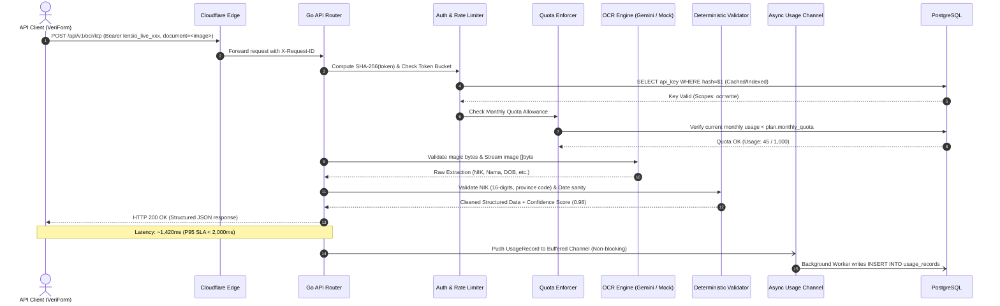

# Lensio System Architecture & Technical Design

> Production architecture specification for Lensio, an Indonesian KTP OCR API platform.  
> Details system components, C4 architectural diagrams, request lifecycles, and fault isolation domains.

---

## 1. System Overview & Core Purpose

Lensio is architected as an API-first B2B software platform. It ingests identity documents (specifically Indonesian KTP cards), classifies and validates document integrity, orchestrates multimodal vision AI inference (Google Gemini 2.0 Flash or deterministic mock engines), extracts structured identity fields (16-digit NIK, full legal name, date/place of birth, address, marital status, religion), and returns deterministic, validated JSON payloads.

Surrounding the core OCR engine is a complete platform engineering lifecycle:
- **Tenant Management & Authentication**: Bearer API keys with SHA-256 one-way hashing and scoped access control.
- **Traffic Protection**: In-memory token bucket rate limiting and monthly quota enforcement.
- **Asynchronous Telemetry**: Non-blocking usage metering, distributed tracing via OpenTelemetry, and Prometheus metrics.
- **Edge Security & Infrastructure**: Cloudflare WAF, Azure Container Apps with KEDA autoscaling, and private PostgreSQL database storage.

---

## 2. C4 Architecture Models

### Level 1: System Context Diagram

Visualizes how external developers, dashboard administrators, and downstream AI services interact with the Lensio boundary:



---

### Level 2: Container Diagram

Breaks down the operational containers running within the Azure Container Apps environment:



---

### Level 3: Component Diagram (Go API Service)

Details the internal Go modular layers within `apps/api/`:



---

## 3. End-to-End Request Lifecycle & Sequence Flow

The following sequence diagram tracks a request through the full pipeline:



---

## 4. Fault Isolation & Health Check Architecture

Lensio enforces strict decoupling between **Process Liveness** and **Dependency Readiness**:

```text
               Kubernetes / Azure Container Apps Probes
                    │                            │
                    ▼                            ▼
            GET /health (Liveness)        GET /ready (Readiness)
                    │                            │
        ┌───────────┴───────────┐        ┌───────┴───────┐
        │ Returns HTTP 200 OK   │        │ Pings DB Pool │
        │ if Go process is alive│        └───────┬───────┘
        └───────────────────────┘                │
                                      ┌──────────┴──────────┐
                                      │                     │
                                Connected (200 OK)    Down / Unreachable (503)
                                      │                     │
                                Routes Traffic        Halts Traffic Routing
                                                      (Container Not Killed)
```

1. **Liveness Probe (`GET /health`)**:
   - Tests only the internal state of the Go process and HTTP listener.
   - Never calls PostgreSQL or upstream APIs.
   - If this fails, the container is deadlocked and ACA restarts the container.
2. **Readiness Probe (`GET /ready`)**:
   - Tests PostgreSQL connection pool using `db.PingContext(ctx)`.
   - Returns HTTP 200 `{"status":"ready","database":"connected"}` when healthy.
   - Returns HTTP 503 `{"status":"not_ready","database":"unreachable"}` when the database is unavailable.
   - Prevents traffic routing to instances that cannot serve queries without causing destructive crash-restart loops.

---

## 5. Security & Privacy Boundaries

1. **Data Minimization Boundary**: The `document` image buffer exists exclusively in volatile RAM during the HTTP handler execution. It is never persisted to disk, blob storage, or database.
2. **Zero PII Logging Boundary**: The structured logger (`log/slog`) rejects all citizen identity fields. Only `request_id`, `trace_id`, status code, latency, and confidence score are written to output streams.
3. **Secret Isolation**: Secrets (DB passwords, AI Studio API keys) are injected exclusively via environment variables from Azure Key Vault or `.env` in local development.

---

## 6. Technology Inventory

| Component | Technology | Role |
|---|---|---|
| **API Runtime** | Go 1.22+ | HTTP routing, concurrency, business logic, validation |
| **Relational Database** | PostgreSQL 16 | Tenant data, API keys, plans, usage metrics, audit trail |
| **Database Driver** | `jackc/pgx/v5` | High-performance Go native PostgreSQL connection pool |
| **Vision AI Provider** | Google Gemini 2.0 Flash | Upstream multimodal image extraction |
| **Test Vision Engine** | `MockOCREngine` | Deterministic synthetic fixture engine for CI |
| **Developer Dashboard** | React 18 + Vite + TypeScript | Frontend developer portal and usage analytics |
| **Telemetry & Metrics** | OpenTelemetry Go SDK + Prometheus | Distributed tracing, RED metrics |
| **Cloud Hosting** | Azure Container Apps (ACA) | Serverless container execution with KEDA autoscaling |
| **Edge & Security** | Cloudflare | Edge CDN, WAF, DDoS protection, TLS 1.3 termination |
| **IaC Orchestration** | OpenTofu + Terragrunt | Declarative multi-environment infrastructure as code |
